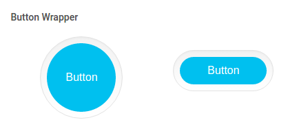

# Buttons

There are twelve variants of buttons based on the colors used in this template, we can change the color of the button just by replacing `btn-primary`with `btn-secondary , btn-info, btn-success, btn-warning, btn-danger`.

Since this template is based on Bootstrap4`btn-default`is depricated and `btn-secondary`is brought into act.

**1\) Basic Buttons:**


It has the following Structure:

```text
<button class="btn btn-primary">Button</button>
```

**2\) Disabled Buttons:**


It has the following Structure::

```text
<button class="btn btn-primary disabled">Button</button>
```

**3\) Outline Buttons:**


It has the following Structure:

```text
<button class="btn btn-outline-primary">Button</button>
```

**4\) Rounded Buttons:**


It has the following Structure:

```text
<button class="btn btn-primary button-rounded">Button</button>
```

**5\) Rectangle Buttons:**


It has the following Structure:

```text
<button class="btn btn-primary button-rectangle">Button</button>
```

**6\) Button Group:**


It has the following Structure:

```text
<div class="btn-group"  role="group">
     <button class="btn btn-primary">Button</button>
     ......
     ......
</div>
```

**7\) Glow Buttons:**


It has the following Structure:

```text
<button class="btn btn-primary button_glow_buttons">Button</button>
```

**8\) Dropdown Buttons:**


It has the following Structure:

```text
<div class="dropdown">
     <button class="btn btn-primary dropdown-toggle"  type="button"  id="about-us2"  data-toggle="dropdown"  aria-haspopup="true"  aria-expanded="false">Button</button>
     <div class="dropdown-menu" aria-labelledby="about-us2">
     <a class="dropdown-item" href="#">....</a>
     ....
     ....
     </div>
</div>
```

**9\) Dropup Buttons:**


It has the following Structure:

```text
<div class="dropup">
     <button class="btn btn-primary dropdown-toggle"  type="button"  id="up1"  data-toggle="dropdown"  aria-haspopup="true"  aria-expanded="false">Button</button>
     <div class="dropdown-menu" aria-labelledby="up1">
     <a class="dropdown-item" href="#">....</a>
     ....
     ....
     </div>
</div>
```

**10\) Button Wrapper:**



It has the following Structure:

```text
<span class="button-wrap">
   <a href="#"  class="button button-pill button-primary">Button</a>
</span>
```

**11\) Social Buttons:**


It has the following Structure:

```text
<a class="btn btn-block btn-social btn-bitbucket">
   <i  class="fa fa-bitbucket"  >........</i>
</a>
```

**12\) cool Buttons:**


It has the following Structure:

```text
<button type="button" class="btn btn-labelled btn-success">
     <span class="btn-label">
          <i class="fa fa-check">  </i>....
     </span>
</button>
```

