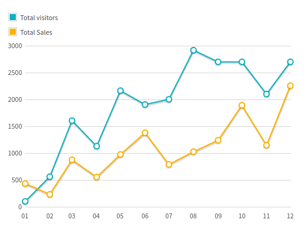
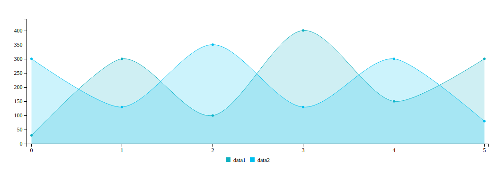
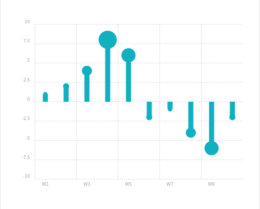
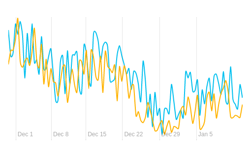

# Charts

To create the charts we use the following plugins [c3](http://c3js.org/), [Chartist](https://gionkunz.github.io/chartist-js/),[Rickshaw charts](http://code.shutterstock.com/rickshaw/) and [Flotchart](http://www.flotcharts.org/). Detailed information about its configuration you can find on their sites.

**1\)** **Flotchart:**

We can find more variants of these plugin on [Flotcharts](http://admire.lorvent.in/charts.html) page of this template.



It has the following design:

```text
<div id="basicFlotLegend" class="flotlegend"> </div>
     <div id="line-chart" class="flotChart1"> </div>
```

**2\) c3:**

We can find more variants of these plugin on [c3](http://admire.lorvent.in/advanced_charts.html) page of this template.

It has the following structure:

```text
<div id="chart2" class="c3"> </div>
```

**3\) chartist:**

We can find more variants of these plugin on [Chartist](http://admire.lorvent.in/chartist.html) page of this template.



It has the following structure:

```text
<div id="draw_events" class="ct-chart ct-perfect-fourth"> </div>
```

**4\) Rickshaw charts:**



It has the following Structure:

```text
<div id="chart_5"> </div>
```

