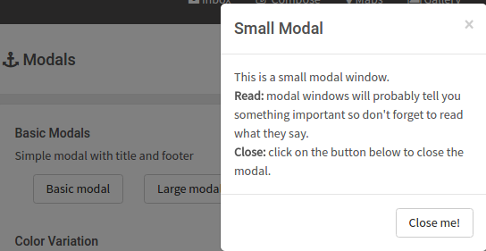
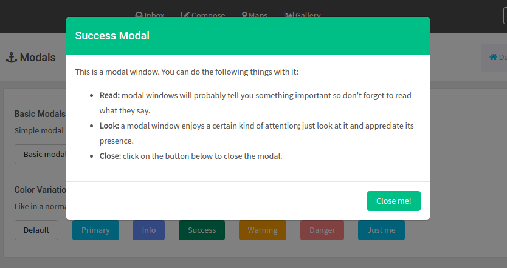
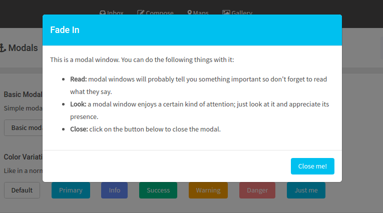
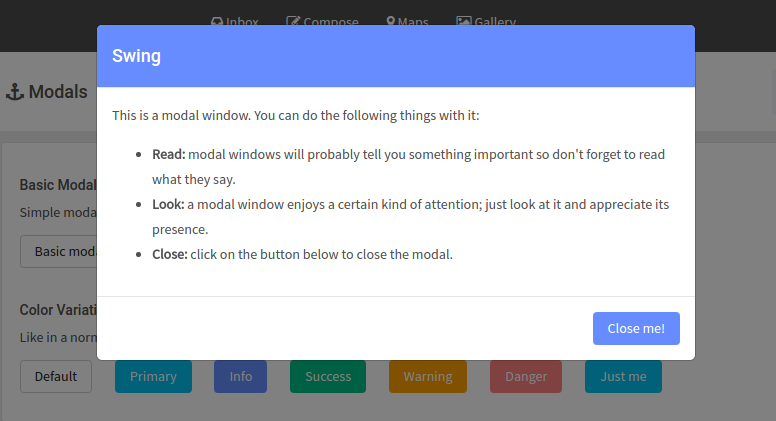
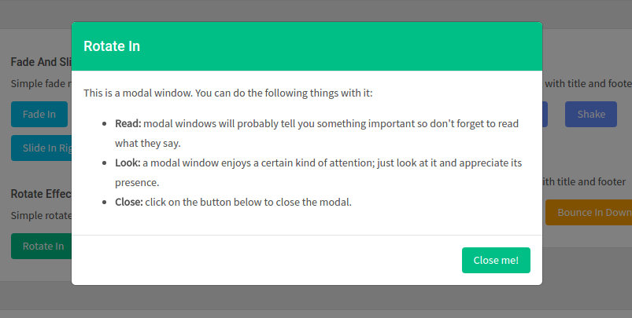
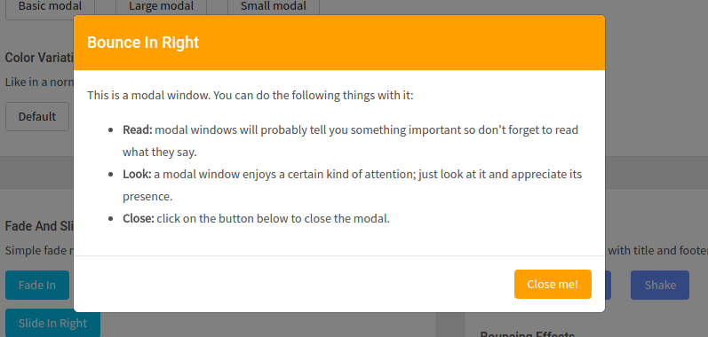
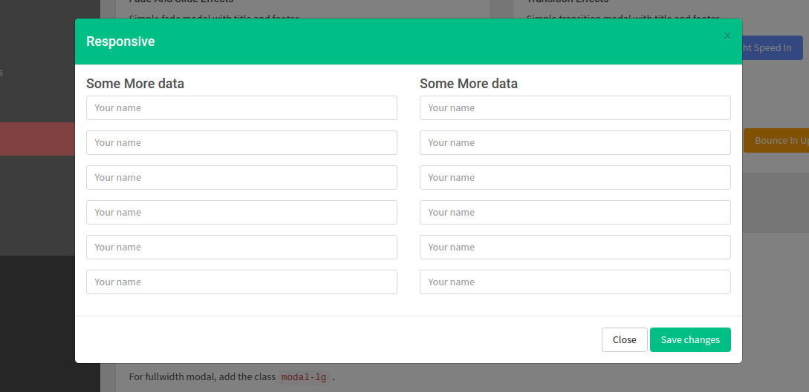
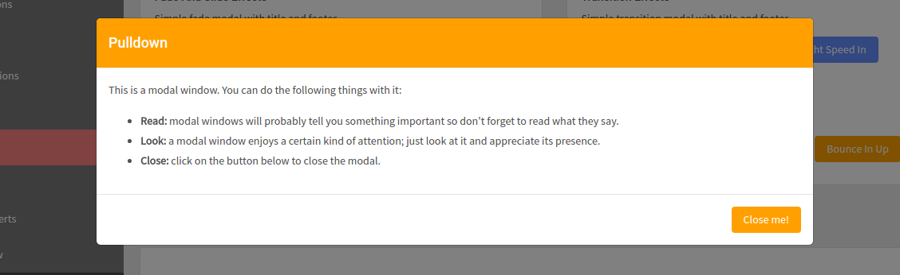
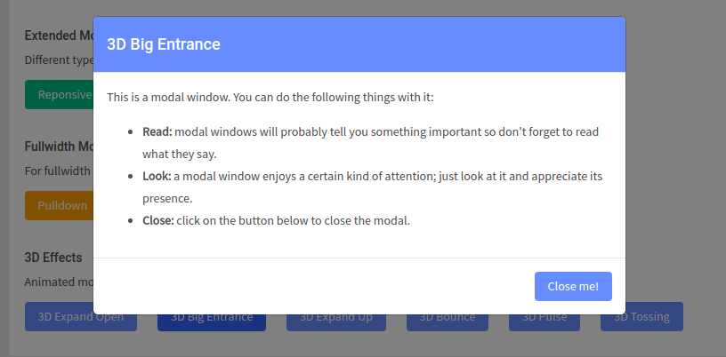

# Modals

This feature is found in the [Modal](http://admire.lorvent.in/modal.html) page of this Template.

There are Nine different kinds of modals included in the above mentioned page. Upon the click on each button a pop up with different fashion appears on the screen.

**1\) Basic Modals**



It has the following Structure:

This is the syntax for the button and with the click on a button, the control goes to the code shown below to display the modal

```text
<button class="btn btn-raised btn-secondary adv_cust_mod_btn" data-toggle="modal" data-target="#normal">Basic Modal</button>
```

Modal Syntax:

```text
<div class="modal fade" id="normal" tab-index="-1" role="dialog" aria-labelledby="modalLabel" aria-hidden="true">
     <div class="modal-dialog" role="document">
          <div class="modal-content">
           ....
           ....
          </div>
      </div>
</div>
```

We can learn more about modals at [Modals](http://getbootstrap.com/).

**2\) Color Variation:**



It has the following Structure:

This is the syntax for the button and with the click on a button, the control goes to the code shown below to display the modal.

```text
<button class="btn btn-raised btn-success md-trigger adv_cust_mod_btn" data-toggle="modal" data-target="#modal-19">Success</button>
```

Modal Syntax:

```text
<div class="modal fade" id="modal-19" role="dialog" aria-labelledby="modalLabeldefault" >
     <div class="modal-dialog" role="document">
          <div class="modal-content">
           ....
           ....
          </div>
      </div>
</div>
```

We can learn more about modals at [Modals](http://getbootstrap.com/).

**3\) Fade And Slide Effects:**



It has the following Structure:

This is the syntax for the button and with the click on a button, the control goes to the code shown below to display the modal.

```text
<button class="btn btn-raised btn-primary adv_cust_mod_btn fadein" data-toggle="modal" data-target="#modal-1">Fade In</button>
```

Modal Syntax:

```text
<div class="modal" id="modal-1" tab-index="-1" role="dialog" aria-labelledby="modalLabelfade" aria-hidden="true">
     <div class="modal-dialog" role="document">
          <div class="modal-content">
           ....
           ....
          </div>
      </div>
</div>
```

We can control the animations for these modals through Js. The code for which is shown below:

```text
$(".fade in").on("click","function") {
  var animationEnd = 'webkitAnimationEnd mozAnimationEnd MSAnimationEnd oanimationend animationend';
  $("#modal-1").addClass("animated fadeIn").one("animationEnd","function()") {
  $("this").removeClass("animated fadeIn");
 });
});
```

We can learn more about modals at [Modals](http://getbootstrap.com/).

**4\) Transition Effects:**



It has the following Structure:

This is the syntax for the button and with the click on a button, the control goes to the code shown below to display the modal.

```text
<button class="btn btn-raised btn-info adv_cust_mod_btn swing" data-toggle="modal" data-target="#modal-swing">Swing</button>
```

Modal Syntax:

```text
<div class="modal" id="modal-swing" tab-index="-1" role="dialog" aria-labelledby="modalLabelswing" aria-hidden="true">
     <div class="modal-dialog" role="document">
          <div class="modal-content">
           ....
           ....
          </div>
      </div>
</div>
```

We can control the animations for these modals through Js. The code for which is shown below:

```text
$(".swing").on("click","function") {
  var animationEnd = 'webkitAnimationEnd mozAnimationEnd MSAnimationEnd oanimationend animationend';
  $("#modal-swing").addClass("animated swing").one("animationEnd","function()") {
  $("this").removeClass("animated swing");
 });
});
```

We can learn more about modals at [Modals](http://getbootstrap.com/).

**5\) Rotate Effects:**



It has the following Structure:

This is the syntax for the button and with the click on a button, the control goes to the code shown below to display the modal.

```text
<button class="btn btn-raised btn-success adv_cust_mod_btn rotatein" data-toggle="modal" data-target="#modal-swing">Rotate In</button>
```

Modal Syntax:

```text
<div class="modal" id="modal-swing" tab-index="-1" role="dialog" aria-labelledby="modalLabelswing" aria-hidden="true">
     <div class="modal-dialog" role="document">
          <div class="modal-content">
           ....
           ....
          </div>
      </div>
</div>
```

We can control the animations for these modals through Js. The code for which is shown below:

```text
$(".rotatein").on("click","function") {
  var animationEnd = 'webkitAnimationEnd mozAnimationEnd MSAnimationEnd oanimationend animationend';
  $("#modal-rotatein").addClass("animated rotateIn").one("animationEnd","function()") {
  $("this").removeClass("animated rotateIn");
 });
});
```

We can learn more about modals at [Modals](http://getbootstrap.com/).

**6\) Bouncing Effects:**



It has the following Structure:

This is the syntax for the button and with the click on a button, the control goes to the code shown below to display the modal.

```text
<button class="btn btn-raised btn-warning adv_cust_mod_btn bounceinright" data-toggle="modal" data-target="#modal-swing">Rotate In</button>
```

Modal Syntax:

```text
<div class="modal" id="modal-swing" tab-index="-1" role="dialog" aria-labelledby="modalLabelswing" aria-hidden="true">
     <div class="modal-dialog" role="document">
          <div class="modal-content">
           ....
           ....
          </div>
      </div>
</div>
```

We can control the animations for these modals through Js. The code for which is shown below:

```text
$(".bounceinright").on("click","function") {
  var animationEnd = 'webkitAnimationEnd mozAnimationEnd MSAnimationEnd oanimationend animationend';
  $("#modal-rotatein").addClass("bounceInRight").one("animationEnd","function()") {
  $("this").removeClass("bounceInRight");
 });
});
```

We can learn more about modals at [Modals](http://getbootstrap.com/).

**7\) Extended Modals:**



It has the following Structure:

This is the syntax for the button and with the click on a button, the control goes to the code shown below to display the modal.

```text
<a class="btn btn-success btn-md adv_cust_mod_btn" data-toggle="modal" data-href="#responsive" href="#responsive">Responsive</button>
```

Modal Syntax:

```text
<div class="modal fade in display_none" id="responsive" tab-index="-1" role="dialog" aria-labelledby="modalLabelswing" aria-hidden="false">
     <div class="modal-dialog modal-lg">
          <div class="modal-content">
           ....
           ....
          </div>
      </div>
</div>
```

We can learn more about modals at [Modals](http://getbootstrap.com/).

**8\) Fullwidth Modal With Effects:**



It has the following Structure:

This is the syntax for the button and with the click on a button, the control goes to the code shown below to display the modal.

```text
<button class="btn btn-raised btn-warning adv_cust_mod_btn" data-toggle="modal" data-target="#modal-4">pulldown</button
```

Modal Syntax:

```text
<div class="modal fade pullDown" id="modal-4" tab-index="-1" role="dialog" aria-labelledby="modalLabelnews" aria-hidden="true">
     <div class="modal-dialog modal-lg" role="document">
          <div class="modal-content">
           ....
           ....
          </div>
      </div>
</div>
```

We can learn more about modals at [Modals](http://getbootstrap.com/).

**9\) 3D Effects:**



It has the following Structure:

This is the syntax for the button and with the click on a button, the control goes to the code shown below to display the modal.

```text
<button class="btn btn-raised btn-info adv_cust_mod_btn" data-toggle="modal" data-target="#modal-9">3D Big Entrance</button>
```

Modal Syntax:

```text
<div class="modal fade bigEntrance" id="modal-9" tab-index="-1" role="dialog" aria-labelledby="Modallabel3dflip" aria-hidden="true">
     <div class="modal-dialog" role="document">
          <div class="modal-content">
           ....
           ....
          </div>
      </div>
</div>
```

We can learn more about modals at [Modals](http://getbootstrap.com/).

