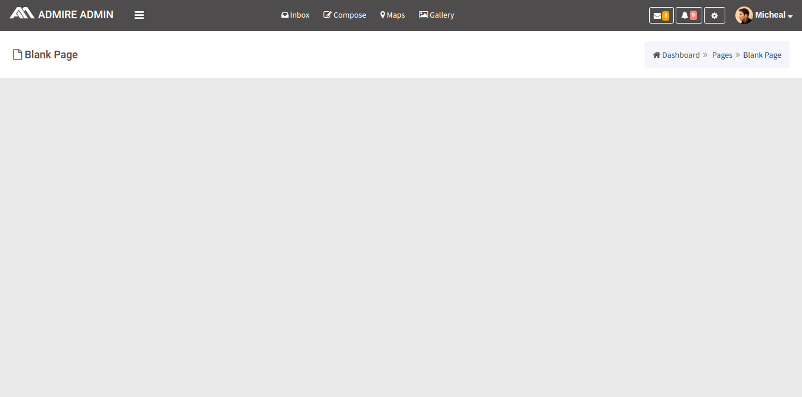
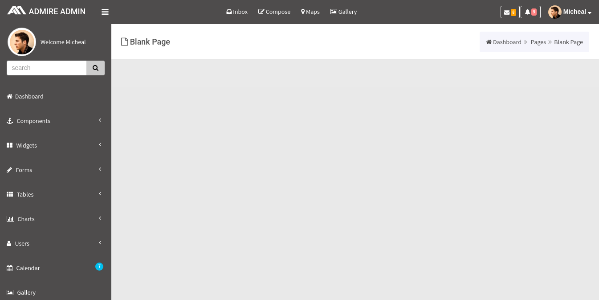
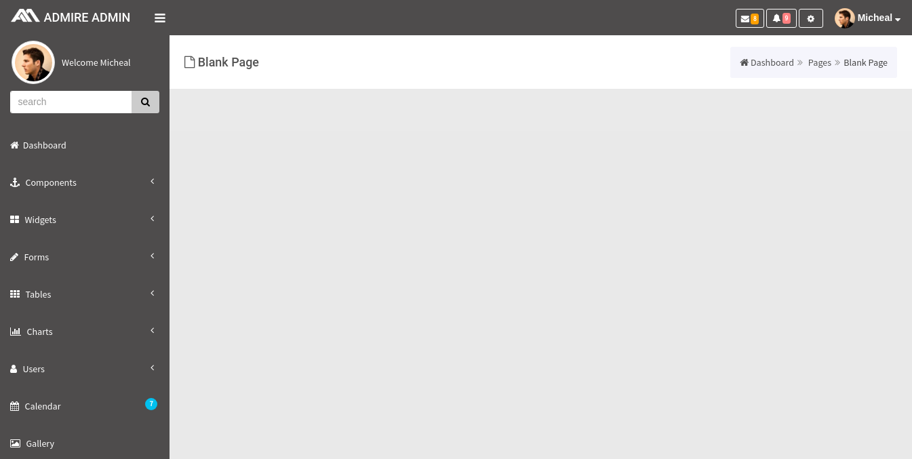

# Black scheme

## 1\) Hide Leftmenu By default :



If we want to hide the left menu by default, we need to add a toggle class `sidebar-left-hidden` to body through js, initially `sidebar-left-hidden` will be appended to the body tag and the left menu will be in a hidden state, with a click on the hamburger, the class disappears dynamically in the body tag and the left menu will be activated.

The Leftmenu has the following structure :

```text
<html>
      <body>
          <div class="bg-dark" id="wrap">

              <========== Start of Leftside Bar ============>

              <div id="left">

                   <div class="media user-media bg-dark dker">

                           ......It contains user details.........

                   </div>

                   <ul id="menu" class="bg-blue dker">

                         ...........It contains left menu list...............

                   </ul>    
              </div>

              <========== End of Leftside Bar ============>

         </div>     
      </body>
 </html>
```

## 2\) Remove Rightmenu :



If we want to remove the RightsideBar, we need to remove the following code which is present in navbar section

```text
            <div class="btn-group">
                  <a class="btn btn-default btn-sm messages toggle-right">
                        <i class="fa fa-cog text-white"></i>
                  </a>
            </div>
```

and we need to remove the code for Rightmenu content which is shown below

```text
            <div id="right">
                     <div class="right_content">
                          .............It contains Right side bar..............
                     </div>
            </div>
```

## 3\) Remove Topbar menu :



If we want to remove topbar menu section we need to remove the following code which is present in navbar section

```text
                  <div class="navbar-toggleable-sm col-xl-6 col-lg-6 hidden-md-down float-right  top_menu" id="nav-content">
                        <ul class="nav navbar-nav top_menubar">
                            <li class="nav-item">

                            </li>
                            <li class="nav-item">

                            </li>
                            <li class="nav-item">

                            </li>
                            <li class="nav-item">

                            </li>
                        </ul>
                    </div>
```

