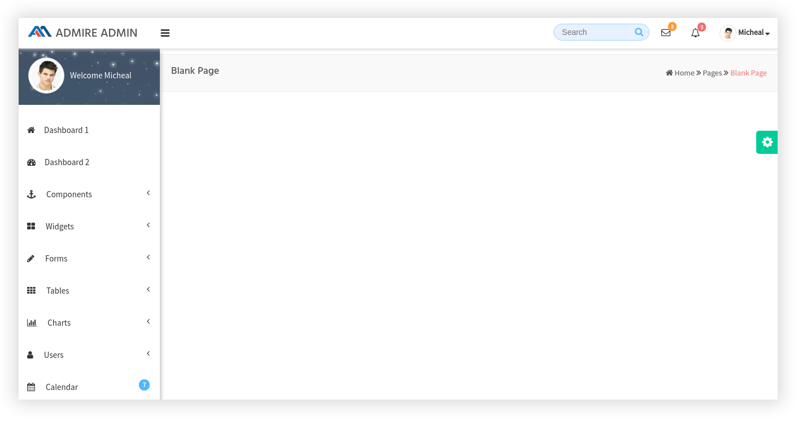
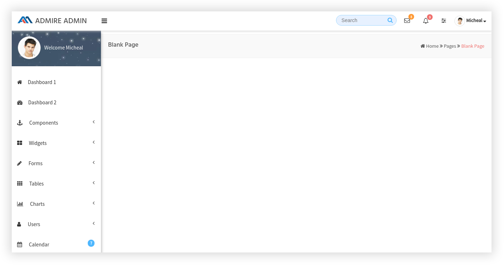

# white scheme

## 1\) Remove Rightside bar :



If we want to remove the RightsideBar, we need to remove the following code which is present in navbar section

```text
                <div class="btn-group">
                      <div class="notifications request_section no-bg">
                           <a class="btn btn-default btn-sm messages" id="request_btn"> <i class="fa fa-sliders" aria-hidden="true"></i>
                           </a>
                      </div>
                </div>
```

and we need to remove the code for Rightmenu content which is shown below

```text
        <========== Start of Right side Bar ============>
        <div id="request_list">
              <div class="request_scrollable">

                   .............It contains Right side bar..............

                   </div>
             </div>

        <========== End of Rightside Bar ============>
```

## 2\) Remove skin colors section :

If we want to remove the skin colors section we need to remove the following code which is present in `custom.js`

```text
var demo = $("<div />").css({
        position: "fixed",
        top: "200px",
        right: "-1px",
        transition: 'all 0.3s ease-in-out',
        background: "#00cc99",
        "border-radius": "5px 0px 0px 5px",
        padding: "5px",
        "font-size": "16px",
        cursor: "pointer",
        color: "#ddd"
    }).html(" <i class='fa fa-fw fa-cog skin-icon'></i>").addClass("no-print");
    $body.append(demo);
    $(".no-print").on("mouseenter mouseleave", function(){
        $(".skin-icon").toggleClass("fa-spin");
        return false;
    });
```

and we need to remove the code for Rightmenu content which is shown below

```text
        <========== Start of colors section ============>

             <div id="right">
                   <div class="right_content">

                   .............It contains Right side bar..............

                   </div>
             </div>

        <========== End of colors sect ============>
```

## 3\) Remove notifications and messages section in navbar :

If you want to remove notifications section in the navbar, we need to remove the following code which is shown below

```text
                    <div class="btn-group">
                        <div class="notifications no-bg">
                            <a class="btn btn-default btn-sm messages" data-toggle="dropdown" id="messages_section"> <i class="fa fa-envelope-o fa-1x"></i>
                                <span class="badge badge-pill badge-warning notifications_badge_top">8</span>
                            </a>
                            <div class="dropdown-menu drop_box_align animated fadeIn" role="menu" id="messages_dropdown">
                            .............Notification Dropdown content........
                            </div>
                        </div>
                    </div>
```

If you want to remove messages section in the navbar, we need to remove the following code which is shown below

```text
                   <div class="btn-group">
                        <div class="notifications no-bg">
                            <a class="btn btn-default btn-sm messages" data-toggle="dropdown" id="messages_section"> <i class="fa fa-envelope-o fa-1x"></i>
                                <span class="badge badge-pill badge-warning notifications_badge_top">8</span>
                            </a>
                            <div class="dropdown-menu drop_box_align animated fadeIn" role="menu" id="messages_dropdown">
                               .............Messages Dropdown content........
                            </div>
                        </div>
                    </div>
```

