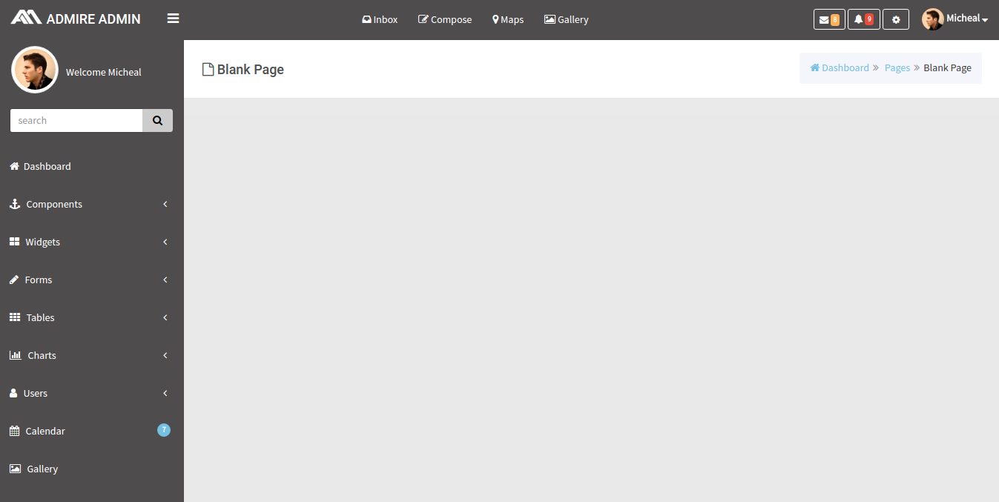
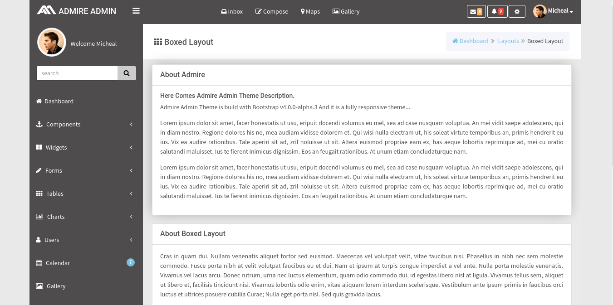
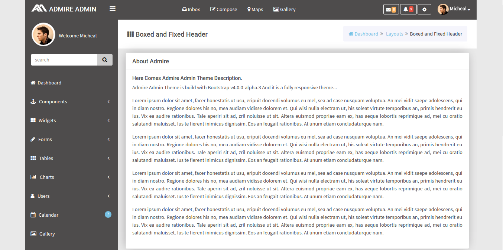
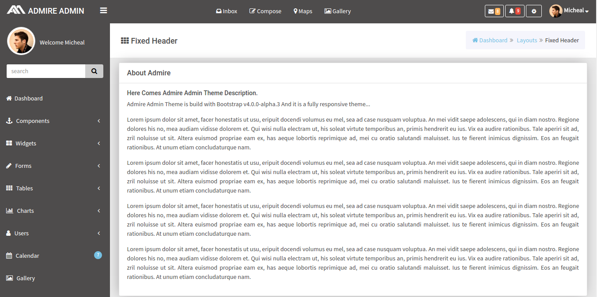
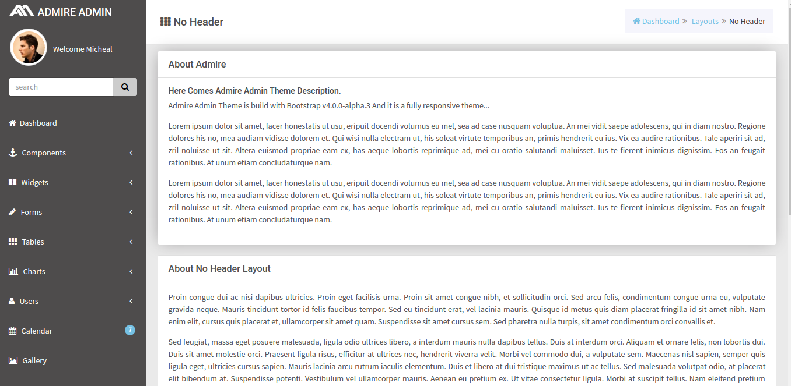
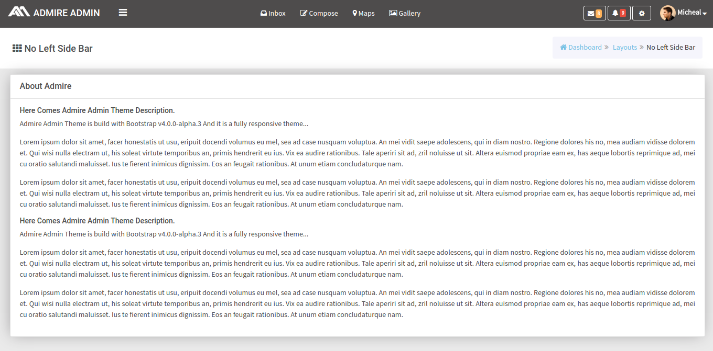

# Black scheme

## How To Start New Page?

The design for the blank page is shown below:



It has the following Structure:

```text
 <html>
      <body>
          <div class="bg-dark" id="wrap">

              <========== Start of Top Bar ============>

              <div id="top">
                   <nav class="navbar navbar-static-top">

                       ........It contains Top bar  ..........      

                   </nav>
              </div>

              <========== End of Top Bar ============>

              <========== Start of Leftside Bar ============>

              <div id="left">

                   <div class="media user-media bg-dark dker">

                           ......It contains user details.........

                   </div>

                   <ul id="menu" class="bg-blue dker">

                         ...........It contains left menu list...............

                   </ul>    
              </div>

              <========== End of Leftside Bar ============>

              <========== Start of Main Content ============>

             <div id="content" class="bg-container">

                  <header class="head">

                       ......It contains Page Header (Breadcrumb)........

                  </header>

                 <div class="outer">

                      <div class="inner bg-light lter bg-container">

                      ....... It contains the Main content of the page ....... 

                      </div>
                  </div>

               </div>

               <========== End of Main Content ============>

               <========== Start of Rightside Bar ============>

               <div id="right">
                    <div class="right_content">

                    .............It contains Right side bar..............

                    </div>
               </div>  

               <========== End of Rightside Bar ============>  
         </div>     
      </body>
 </html>
```

## i\) Boxed Layout

The design for the blank page is shown below:



It has the following Structure:

```text
<html>
    <body class="boxed">

       <div class="bg-dark" id="wrap">

            <========== Start of Top Bar ============>

            <div id="top">
                <nav class="navbar navbar-static-top">

                    ........It contains Top bar ..........

                </nav>
            </div>

            <========== End of Top Bar ============>

            <div class="wrapper">

            <========== Start of Leftside Bar ============>

            <div id="left">

                <div class="media user-media bg-dark dker">

                     ......It contains user details.........

                </div>

                <ul id="menu" class="bg-blue dker">

                    ...........It contains left menu list...............
                </ul>

            </div>

           <========== End of Leftside Bar ============>

           <========== Start of Main Content ============>

           <div id="content" class="bg-container">

                <header class="head">

                 ......It contains Page Header (Breadcrumb)........

                </header>

                <div class="outer">

                    <div class="inner bg-light lter bg-container">

                     ....... It contains the Main content of the page .......

                    </div>
                </div>

           </div>

          <========== End of Main Content ============>

        </div>


          <========== Start of Rightside Bar ============>

           <div id="right">
                <div class="right_content">

                .............It contains Right side bar..............

                </div>
           </div>

           <========== End of Rightside Bar ============>
     </div>
  </body>
</html>
```

## ii\) Boxed & Fixed Header

The design for the blank page is shown below:



It has the following Structure

```text
<html>
    <body class="boxed">

       <div class="bg-dark" id="wrap">

            <========== Start of Top Bar ============>

            <div id="top">
                <nav class="navbar navbar-static-top navbar-fixed-top">

                    ........It contains Top bar ..........

                </nav>
            </div>

            <========== End of Top Bar ============>

           <div class="wrapper">

            <========== Start of Leftside Bar ============>


            <div id="left">

                <div class="media user-media bg-dark dker">

                     ......It contains user details.........

                </div>

                <ul id="menu" class="bg-blue dker">

                    ...........It contains left menu list...............
                </ul>

            </div>

           <========== End of Leftside Bar ============>

           <========== Start of Main Content ============>

           <div id="content" class="bg-container">

                <header class="head">

                 ......It contains Page Header (Breadcrumb)........

                </header>

                <div class="outer">

                    <div class="inner bg-light lter bg-container">

                     ....... It contains the Main content of the page .......

                    </div>
                </div>

           </div>

          <========== End of Main Content ============>

          </div>

          <========== Start of Rightside Bar ============>

           <div id="right">
                <div class="right_content">

                .............It contains Right side bar..............

                </div>
           </div>

           <========== End of Rightside Bar ============>
     </div>
  </body>
</html>
```

## iii\) Fixed Header & Menu

The design for the blank page is shown below:


It has the following Structure:

```text
<html>
    <body>

       <div class="bg-dark" id="wrap">

            <========== Start of Top Bar ============>

            <div id="top">
                <nav class="navbar navbar-static-top navbar-fixed-top">

                    ........It contains Top bar ..........

                </nav>
            </div>

            <========== End of Top Bar ============>

           <div class="wrapper">

            <========== Start of Leftside Bar ============>


            <div id="left"  class="fixed-header_menu">

                <div class="media user-media bg-dark dker">

                     ......It contains user details.........

                </div>

                <ul id="menu" class="bg-blue dker">

                    ...........It contains left menu list...............
                </ul>

            </div>

           <========== End of Leftside Bar ============>

           <========== Start of Main Content ============>

           <div id="content" class="bg-container">

                <header class="head">

                 ......It contains Page Header (Breadcrumb)........

                </header>

                <div class="outer">

                    <div class="inner bg-light lter bg-container">

                     ....... It contains the Main content of the page .......

                    </div>
                </div>

           </div>

          <========== End of Main Content ============>

          </div>

          <========== Start of Rightside Bar ============>

           <div id="right">
                <div class="right_content">

                .............It contains Right side bar..............

                </div>
           </div>

           <========== End of Rightside Bar ============>
     </div>
  </body>
</html>
```

## iv\) Fixed Header

The design for the blank page is shown below:



It has the following structure :

```text
<html>
    <body>

       <div class="bg-dark" id="wrap">

            <========== Start of Top Bar ============>

            <div id="top">
                <nav class="navbar navbar-static-top navbar-fixed-top">

                    ........It contains Top bar ..........

                </nav>
            </div>

            <========== End of Top Bar ============>

           <div class="wrapper">

            <========== Start of Leftside Bar ============>


            <div id="left">

                <div class="media user-media bg-dark dker">

                     ......It contains user details.........

                </div>

                <ul id="menu" class="bg-blue dker">

                    ...........It contains left menu list...............
                </ul>

            </div>

           <========== End of Leftside Bar ============>

           <========== Start of Main Content ============>

           <div id="content" class="bg-container">

                <header class="head">

                 ......It contains Page Header (Breadcrumb)........

                </header>

                <div class="outer">

                    <div class="inner bg-light lter bg-container">

                     ....... It contains the Main content of the page .......

                    </div>
                </div>

           </div>

          <========== End of Main Content ============>

          </div>

          <========== Start of Rightside Bar ============>

           <div id="right">
                <div class="right_content">

                .............It contains Right side bar..............

                </div>
           </div>

           <========== End of Rightside Bar ============>
     </div>
  </body>
</html>
```

## v\) Boxed & Fixed Menu

The design for the blank page is shown below:


It has the following Structure:

```text
<html>
    <body class="boxed">

       <div class="bg-dark" id="wrap">

            <========== Start of Top Bar ============>

            <div id="top">
                <nav class="navbar navbar-static-top">

                    ........It contains Top bar ..........

                </nav>
            </div>

            <========== End of Top Bar ============>

           <div class="wrapper">

            <========== Start of Leftside Bar ============>


            <div id="left" class="fixed_menu">

                <div class="media user-media bg-dark dker">

                     ......It contains user details.........

                </div>

                <ul id="menu" class="bg-blue dker">

                    ...........It contains left menu list...............
                </ul>

            </div>

           <========== End of Leftside Bar ============>

           <========== Start of Main Content ============>

           <div id="content" class="bg-container">

                <header class="head">

                 ......It contains Page Header (Breadcrumb)........

                </header>

                <div class="outer">

                    <div class="inner bg-light lter bg-container">

                     ....... It contains the Main content of the page .......

                    </div>
                </div>

           </div>

          <========== End of Main Content ============>

          </div>

          <========== Start of Rightside Bar ============>

           <div id="right">
                <div class="right_content">

                .............It contains Right side bar..............

                </div>
           </div>

           <========== End of Rightside Bar ============>
     </div>
  </body>
</html>
```

## vi\) Fixed Menu

The design for the blank page is shown below:


It has the following Structure:

```text
<html>
    <body>

       <div class="bg-dark" id="wrap">

            <========== Start of Top Bar ============>

            <div id="top">
                <nav class="navbar navbar-static-top">

                    ........It contains Top bar ..........

                </nav>
            </div>

            <========== End of Top Bar ============>

           <div class="wrapper">

            <========== Start of Leftside Bar ============>


            <div id="left" class="fixed_menu">

                <div class="media user-media bg-dark dker">

                     ......It contains user details.........

                </div>

                <ul id="menu" class="bg-blue dker">

                    ...........It contains left menu list...............
                </ul>

            </div>

           <========== End of Leftside Bar ============>

           <========== Start of Main Content ============>

           <div id="content" class="bg-container">

                <header class="head">

                 ......It contains Page Header (Breadcrumb)........

                </header>

                <div class="outer">

                    <div class="inner bg-light lter bg-container">

                     ....... It contains the Main content of the page .......

                    </div>
                </div>

           </div>

          <========== End of Main Content ============>

          </div>

          <========== Start of Rightside Bar ============>

           <div id="right">
                <div class="right_content">

                .............It contains Right side bar..............

                </div>
           </div>

           <========== End of Rightside Bar ============>
     </div>
  </body>
</html>
```

## vii\) No Header

The design for the blank page is shown below:



It has the following Structure:

```text
<html>
<body>
      <div class="bg-dark" id="wrap">

       <========== Start of Leftside Bar ============>

      <div id="left">

          <div class="media user-media bg-dark dker">

               ......It contains user details.........

           </div>

           <ul id="menu" class="bg-blue dker">

              ...........It contains left menu list...............

           </ul>
       </div>

       <========== End of Leftside Bar ============>

        <========== Start of Main Content ============>

        <div id="content" class="bg-container">

       <header class="head">

           ......It contains Page Header (Breadcrumb)........

       </header>

        <div class="outer">

            <div class="inner bg-light lter bg-container">

                ....... It contains the Main content of the page .......

            </div>
        </div>

    </div>

<========== End of Main Content ============>

<========== Start of Rightside Bar ============>

    <div id="right">
         <div class="right_content">

         ............It contains Right side bar..............

         </div>
    </div>

<========== End of Rightside Bar ============>
    </div>
  </body>
</html>
```

**viii\) No Left Sidebar**

The design for the blank page is shown below:



It has the following Structure:

```text
<html>
    <body>

       <div class="bg-dark" id="wrap">

            <========== Start of Top Bar ============>

            <div id="top">
                <nav class="navbar navbar-static-top">

                    ........It contains Top bar ..........

                </nav>
            </div>

            <========== End of Top Bar ============>

           <div class="wrapper">

            <========== Start of Leftside Bar ============>


            <div id="left" class="fixed_menu">

                <div class="media user-media bg-dark dker">

                     ......It contains user details.........

                </div>

                <ul id="menu" class="bg-blue dker">

                    ...........It contains left menu list...............
                </ul>

            </div>

           <========== End of Leftside Bar ============>

           <========== Start of Main Content ============>

           <div id="content" class="bg-container">

                <header class="head">

                 ......It contains Page Header (Breadcrumb)........

                </header>

                <div class="outer">

                    <div class="inner bg-light lter bg-container">

                     ....... It contains the Main content of the page .......

                    </div>
                </div>

           </div>

          <========== End of Main Content ============>

          </div>

          <========== Start of Rightside Bar ============>

           <div id="right">
                <div class="right_content">

                .............It contains Right side bar..............

                </div>
           </div>

           <========== End of Rightside Bar ============>
     </div>
  </body>
</html>
```

