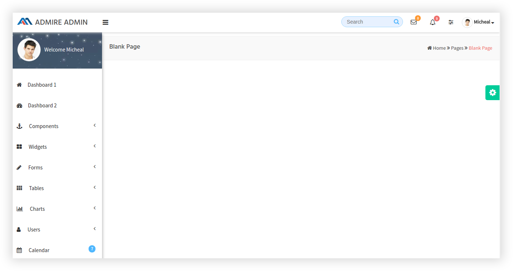
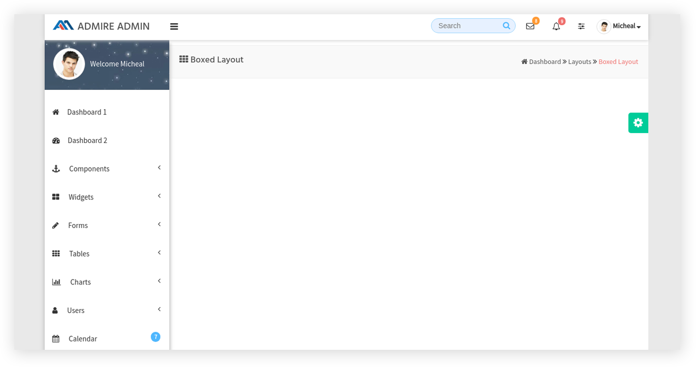
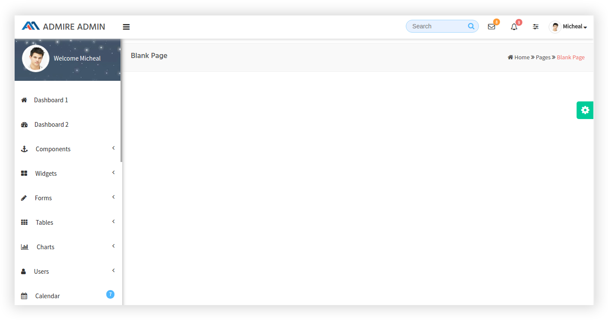
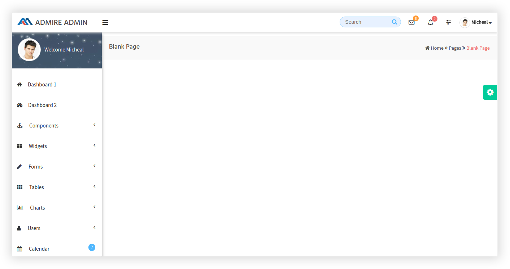
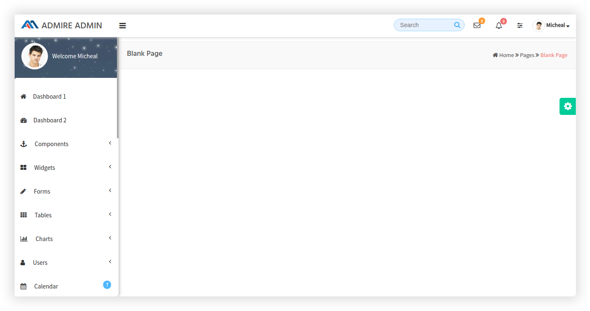
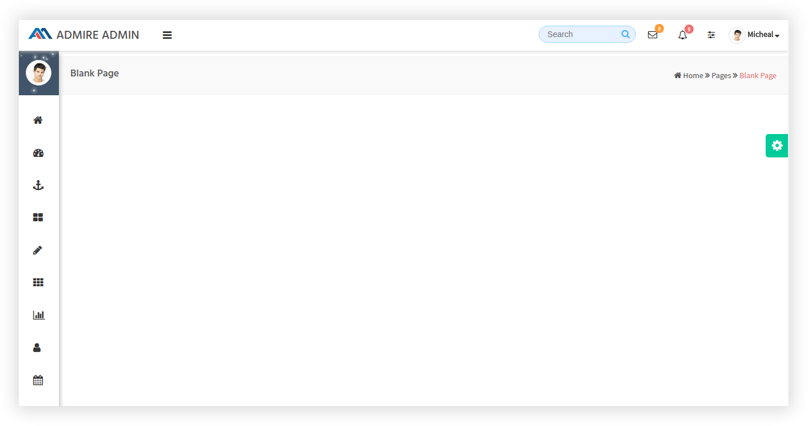

# White scheme

## How To Start New Page?

The design for the blank page is shown below:It has the following Structure:

```text
 <html>
      <body>
            <div id="wrap">

                 <========== Start of Top Bar ============>

                 <div id="top>
                    <nav class="navbar navbar-static-top">

                      ........It contains Top bar ..........

                    </nav>
                 </div>

                 <========== End of Top Bar ============>

                 <div class="wrapper">

                 <========== Start of Left Side Menu ============>

                     <div id="left">
                          <div class="menu_scroll">
                               <ul id="menu">

                                   ...........It contains left menu list...............

                               </ul>
                          </div>
                     </div>

                <========== End of Left Side Menu ============>

                <========== Start of Main Content ============>

                     <div id="content" class="bg-container">

                         <header class="head">

                              ......It contains Page Header (Breadcrumb)........
                         </header>
                         <div class="outer">

                         ....... It contains the Main content of the page .......

                         </div>

                        </div>

                  <========== End of Main Content ============>

                   </div>

                  <========== Start of Right side Bar ============>

                  <div id="request_list">

                      ................It contains Right side list.................

                  </div> 

                  <========== End of Right side Bar ============>

                  <========== Start of skins colors section ============>

                  <div id="right">
                      <div class="right_content">

                      .............It contains colors section..............

                      </div>      
                  </div>

                  <========== End of skins colors section ============>

               </div>  
      </body>
 </html>
```

## i\) Boxed Layout

The design for the blank page is shown below:It has the following Structure:

```text
<html>
    <body class="boxed">
        <div id="wrap">

        <========== Start of Top Bar ============>

        <div id="top>
             <nav class="navbar navbar-static-top">

             ........It contains Top bar ..........

             </nav>
        </div>

        <========== End of Top Bar ============>

        <div class="wrapper">

             <========== Start of Left Side Menu ============>

             <div id="left">
                  <div class="menu_scroll  left_scrolled">
                       <ul id="menu">

                         ..........It contains left menu list...............

                       </ul>
                  </div>
              </div>

            <========== End of Left Side Menu ============>

            <========== Start of Main Content ============>

            <div id="content" class="bg-container">

                  <header class="head">

                  ......It contains Page Header (Breadcrumb)........

                 </header>
                 <div class="outer">

                 ....... It contains the Main content of the page .......

                 </div>

           </div>

            <========== End of Main Content ============>

       </div>

            <========== Start of Right side Bar ============>

               <div id="request_list">

                    ................It contains Right side list.................

               </div>

            <========== End of Right side Bar ============>

           <========== Start of skins colors section ============>

            <div id="right">
                <div class="right_content">

                .............It contains colors section..............

               </div>
            </div>

          <========== End of skins colors section ============>

    </div>
</body>
</html>
```

## ii\)  Fixed Menu

The design for the blank page is shown below:



It has the following Structure

```text
<html>
    <body class="fixedMenu_left">
        <div id="wrap">

        <========== Start of Top Bar ============>

        <div id="top>
             <nav class="navbar navbar-static-top">

             ........It contains Top bar ..........

             </nav>
        </div>

        <========== End of Top Bar ============>

        <div class="wrapper">

             <========== Start of Left Side Menu ============>

             <div id="left" class="fixed">
                  <div class="menu_scroll left_scrolled">
                       <ul id="menu">

                         ..........It contains left menu list...............

                       </ul>
                  </div>
              </div>

            <========== End of Left Side Menu ============>

            <========== Start of Main Content ============>

            <div id="content" class="bg-container">

                  <header class="head">

                  ......It contains Page Header (Breadcrumb)........

                 </header>
                 <div class="outer">

                 ....... It contains the Main content of the page .......

                 </div>

           </div>

            <========== End of Main Content ============>

       </div>

           <========== Start of Right side Bar ============>

          <div id="request_list">

               ................It contains Right side list.................

          </div>

          <========== End of Right side Bar ============>

          <========== Start of skins colors section ============>

          <div id="right">
               <div class="right_content">

               .............It contains colors section..............

               </div>
          </div>

          <========== End of skins colors section ============>

    </div>
</body>
</html>
```

## iii\) Fixed Header

The design for the blank page is shown below:



It has the following Structure:

```text
<html>
    <body class="fixedNav_position">
        <div id="wrap">

        <========== Start of Top Bar ============>

        <div id="top"  class="fixed">
             <nav class="navbar navbar-static-top">

             ........It contains Top bar ..........

             </nav>
        </div>

        <========== End of Top Bar ============>

        <div class="wrapper fixedNav_top">

             <========== Start of Left Side Menu ============>

             <div id="left">
                  <div class="menu_scroll">
                       <ul id="menu">

                         ..........It contains left menu list...............

                       </ul>
                  </div>
              </div>

            <========== End of Left Side Menu ============>

            <========== Start of Main Content ============>

            <div id="content" class="bg-container">

                  <header class="head">

                  ......It contains Page Header (Breadcrumb)........

                 </header>
                 <div class="outer">

                 ....... It contains the Main content of the page .......

                 </div>

           </div>

            <========== End of Main Content ============>

       </div>

            <========== Start of Right side Bar ============>

               <div id="request_list">

               ................It contains Right side list.................

               </div>

            <========== End of Right side Bar ============>

            <========== Start of skins colors section ============>

              <div id="right">
                 <div class="right_content">

                 .............It contains colors section..............

                 </div>
             </div>

           <========== End of skins colors section ============>

    </div>
</body>
</html>
```

## iv\) Fixed Menu and Header

The design for the blank page is shown below:

It has the following Structure:

```text
<html>
    <body class="fixedNav_position fixedMenu_left">
        <div id="wrap">

        <========== Start of Top Bar ============>

        <div id="top"  class="fixed">
             <nav class="navbar navbar-static-top">

             ........It contains Top bar ..........

             </nav>
        </div>

        <========== End of Top Bar ============>

        <div class="wrapper fixedNav_top">

             <========== Start of Left Side Menu ============>

             <div id="left"  class="fixed">
                  <div class="menu_scroll left_scrolled">
                       <ul id="menu">

                         ..........It contains left menu list...............

                       </ul>
                  </div>
              </div>

            <========== End of Left Side Menu ============>

            <========== Start of Main Content ============>

            <div id="content" class="bg-container">

                  <header class="head">

                  ......It contains Page Header (Breadcrumb)........

                 </header>
                 <div class="outer">

                 ....... It contains the Main content of the page .......

                 </div>

           </div>

            <========== End of Main Content ============>

       </div>

            <========== Start of Right side Bar ============>

               <div id="request_list">

               ................It contains Right side list.................

              </div>

            <========== End of Right side Bar ============>

            <========== Start of skins colors section ============>

            <div id="right">
                 <div class="right_content">

                     .............It contains colors section..............

                 </div>
           </div>

           <========== End of skins colors section ============>

    </div>
</body>
</html>
```

## v\) Compact Menu

The design for the blank page is shown below:

In this layout, the class `sidebar-left-hidden` gets added to the body tag through Js , which is responsible for the compact menu.

It has the following Structure:

```text
<html>
      <body>
            <div id="wrap">

                 <========== Start of Top Bar ============>

                 <div id="top>
                    <nav class="navbar navbar-static-top">

                      ........It contains Top bar ..........

                    </nav>
                 </div>

                 <========== End of Top Bar ============>

                 <div class="wrapper">

                 <========== Start of Left Side Menu ============>

                     <div id="left">
                          <div class="menu_scroll">
                               <ul id="menu">

                                   ...........It contains left menu list...............

                               </ul>
                          </div>
                     </div>

                <========== End of Left Side Menu ============>

                <========== Start of Main Content ============>

                     <div id="content" class="bg-container">

                         <header class="head">

                              ......It contains Page Header (Breadcrumb)........
                         </header>
                         <div class="outer">

                         ....... It contains the Main content of the page .......

                         </div>

                        </div>

                  <========== End of Main Content ============>

                   </div>

                 <========== Start of Right side Bar ============>

                 <div id="request_list">

                    ................It contains Right side list.................

                 </div>

                 <========== End of Right side Bar ============>
                 <========== Start of skins colors section ============>

                 <div id="right">
                      <div class="right_content">

                   .............It contains colors section..............

                      </div>
                 </div>

                <========== End of skins colors section ============>

               </div>  
      </body>
 </html>
```

